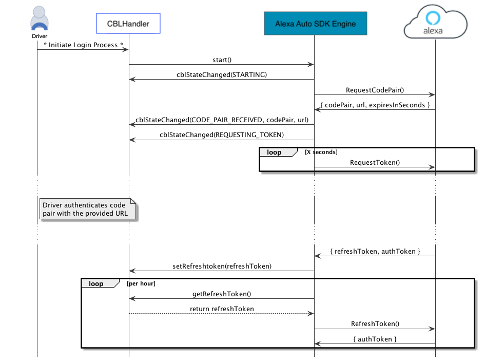

# Code-Based Linking (CBL) Module


The Alexa Auto SDK CBL module provides the features required by a platform implementation to fully handle the authentication flow with Alexa. The platform implementation is responsible for storing and supplying the refresh token to the SDK.

**Table of Contents**

* [Sequence Diagrams](#sequence-diagrams)
* [Using CBL](#using-cbl)


## Sequence Diagrams <a id = "sequence-diagrams"></a>

The following sequence diagrams provide an overview of the authentication flow and the process of refreshing the authentication when the application provides a valid refresh token.

### Initial authentication flow

This diagram provides an overview of the initial authenticaion flow.


### Refreshing token

This diagram provides an overview of how CBL refreshes your authentication on startup.


## Using CBL<a id="using-cbl"></a>

To implement a custom CBL handler, extend the `CBL` class:

    #include <AACE/CBL/CBL.h>

    class MyCBLHandler : public aace::cbl::CBL {

        // Notifing the platform for a state change in authorization flow with reason
        void cblStateChanged( CBLState state, CBLStateChangedReason reason, const std::string& url, const std::string& code ) {
            // Display url and code when supplied
            // Track state
        }

        void clearRefreshToken() {
            // Remove refresh token from platform application
        }

        void setRefreshToken( const std::string& refreshToken ) {
            // Set refresh token
            // The platform application is responsible for storing the refresh token securely
        }

        std::string getRefreshToken() {
            // Return refresh token, if available, otherwise empty string
        }

        void setUserProfile( const std::string& name, const std::string& email ) {
            // Set name and email
            // The platform application will be notified during login
        }

        // Begin authorization flow
        start();
        ...

        // Cancel authorization flow
        cancel();
        ...

        // Reset authorization state
        reset();
        ...
    };

    // Register a CBL handler with the Engine
    std::shared_ptr<CBL> cbl = std::make_shared<MyCBLHandler>();
    engine->registerPlatformInterface( cbl );

Use this configuration to enable a user profile:
```json
{
    "aace.cbl": {
        "enableUserProfile": true
    }
}
```
